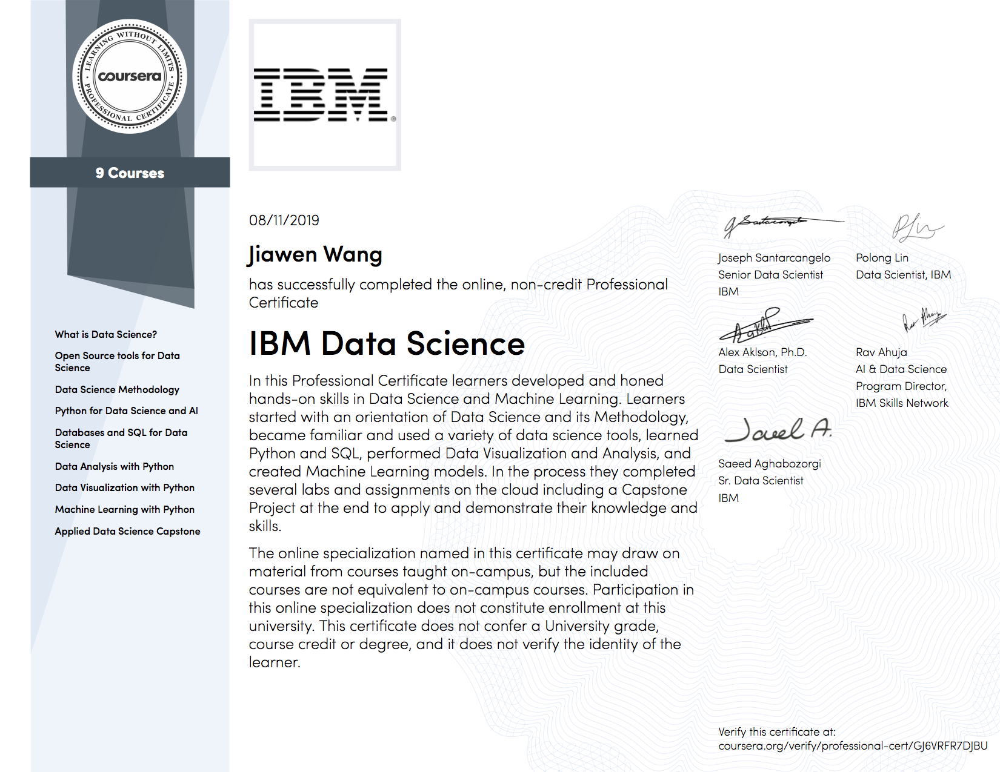

# Hi, I'm Jiawen.

I'm a hard-working and enthusiastic upcoming computer science graduate from McGill University in Montreal, Canada. I'm always seeking to improve both as a programmer and as a team member.

**Some of my technical skills include:**
- Java (6+ years): Debugging, testing and OOP. Solid understanding of the Software Development life cycle, UML diagrams, and the MVC model.
- C/C++ (2+ years): Includes first-hand experience with low-level programming.
- GNU/Linux (2 years): practical experience including command-line scripting (bash), make/Makefiles, and version control (Git/GitHub)
- Python (1+ year): practical knowledge of data science tools (pandas, numpy, scikit-learn)
- Functional programming (1+ year)
- Working knowledge of other languages including HTML/CSS, JavaScript, including NodeJS, and ReactJS, OCaml and SQL.

## My Education  
McGill University, Montreal QC (2015-Present)  
**Some of the courses I've taken include**: Software Systems, Software Design, Algorithms and Data Structures, Programming Languages and Paradigms, Compiler Design, Algorithm Design, Operating Systems, Modern Computer Games, Operating Systems

## Personal Development
### IBM Data Science Professional Certificate
A 9-course specialization by IBM on Coursera. Specialization Certificate earned on August 11, 2019

[View Certificate](https://www.coursera.org/account/accomplishments/specialization/certificate/GJ6VRFR7DJBU)
#### Course Certificates Completed
- What is Data Science?
- Open Source tools for Data Science
- Data Science Methodology
- Python for Data Science and AI
- Databases and SQL for Data Science
- Data Analysis with Python
- Data Visualization with Python
- Machine Learning with Python
- Applied Data Science Capstone

### Hobbies and Extracurriculars
- Graphic Designer, contributor, marketer, and editor for an upcoming book on neurotechnology, in collaboration with the educational non-profit NeuroTechX
- Mental Health Outreach Committee member at McGill University
- Science writer/contributor to campus newspaper, The McGill Tribune
- Previously a Science Advising Assistant for McGill's Science Advising Office to help incoming first-year students with course selection. 
- Game development and design in Unity3D including C# programming

